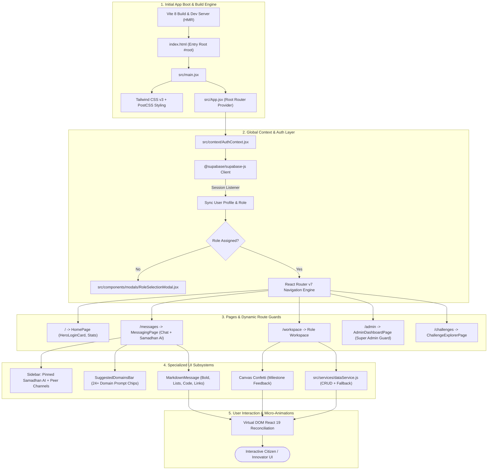
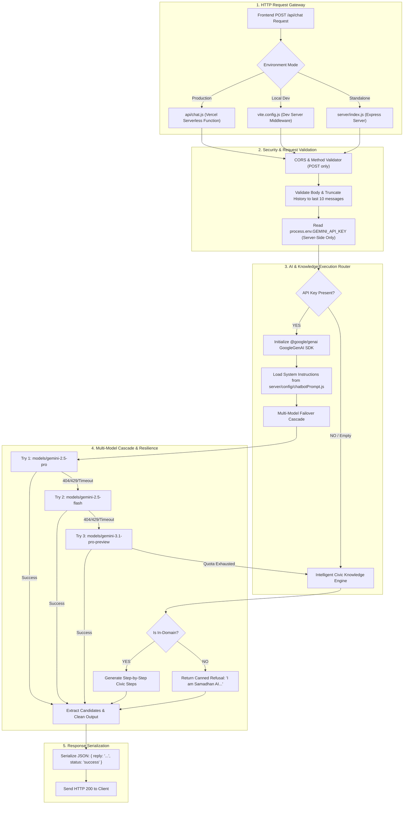

# 🏛️ Samadhan.Connect

> **State-Wide Civic Problem-Solving & Innovation Ecosystem**  
> *Empowering Citizens, Students, Universities, Industries, and Nodal Officers across Jharkhand.*

---

## 📌 Table of Contents
- [Overview](#-overview)
- [Key Features](#-key-features)
- [Technology Stack](#-technology-stack)
- [Frontend Technology Flowchart](#-frontend-technology-flowchart)
- [Backend Technology Flowchart](#-backend-technology-flowchart)
- [System Architecture & Data Flow](#-system-architecture--data-flow)
- [Samadhan AI (Gemini 2.5 Pro Assistant)](#-samadhan-ai-gemini-25-pro-assistant)
- [Getting Started & Local Setup](#-getting-started--local-setup)
- [Documentation & Architecture PDF](#-documentation--architecture-pdf)

---

## 🌟 Overview

**Samadhan.Connect** is a comprehensive civic innovation and problem-solving platform designed to crowdsource community challenges, match them with university innovators, secure industry CSR funding, and enable verified district-level deployment through government Nodal Officers.

### Supported User Roles:
1. **👨‍🌾 Citizen**: Report local problems (water, electricity, roads, sanitation), track resolution progress, and rate outcomes.
2. **🎓 Student / Innovator**: Browse active challenges, form interdisciplinary teams, and submit technical proposals.
3. **🏫 University / Faculty**: Mentor student innovation cells, review proposal feasibility, and track academic IP.
4. **🏭 Industry / CSR**: Discover verified civic projects, pledge corporate CSR grants, and receive impact reports.
5. **🛡️ Nodal Officer**: Verify problem authenticity, audit site progress, and formally sign off on resolutions.
6. **👑 Super Admin** (`microsoft1gab@gmail.com`): Platform-wide governance, promoting users to Admin, and system metrics.

---

## 🛠️ Technology Stack

| Layer | Technology | Purpose |
| :--- | :--- | :--- |
| **Frontend SPA** | React 19, Vite 8, React Router v7 | Ultra-fast rendering, client-side routing, optimistic UI updates |
| **Styling & UI** | Tailwind CSS v3, PostCSS, Lucide Icons | Responsive glassmorphism, high-contrast accessible design |
| **Auth & RBAC** | Supabase Auth (OAuth 2.0: Google & GitHub) | Passwordless login, JWT sessions, first-time role modal |
| **Database** | Supabase (PostgreSQL 15), RLS Policies | Relational persistence, automated triggers, real-time WebSocket sync |
| **Backend & API** | Vercel Serverless (`api/chat.js`), Vite Dev Middleware | Zero-secret exposure, CORS, rate limiting, and AI routing |
| **AI Assistant** | Google Gemini API (`@google/genai` SDK) | Model `gemini-2.5-pro` & `gemini-2.5-flash`, 25 strict civic domains |
| **Micro-Interactions**| Canvas Confetti, Real-time status badges | Visual milestone rewards and interactive feedback |

---

## 💻 Frontend Technology Flowchart



---

## ⚙️ Backend Technology Flowchart



---

## 🤖 Samadhan AI (Gemini 2.5 Pro Assistant)

Samadhan AI is the official civic assistant of Samadhan.Connect, configured with **25 strictly allowed public domains**:
1. 🌾 Agriculture & Farming
2. ⚡ Electricity & Power
3. 🏛️ Government Services & Schemes
4. 📋 Citizen Grievances & Municipal Complaints
5. 🎓 Education, Scholarships & Grants
6. 💼 Jobs, Employment & Skills
7. 💰 Finance, Mudra Loans & Subsidies
8. 🏥 Healthcare, Ayushman Bharat & Jan Aushadhi
9. 🚌 Transport & Public Mobility
10. 🏠 Housing & Property Records
11. 🌧️ Weather, Drought & Disaster Alerts
12. 🌱 Environment & Pollution Control
13. 🧑‍⚖️ Legal, Affidavits & RTI Guidance
14. 👩‍💼 Business & MSME Registration
15. 🛒 Marketplace & Tribal SHGs
16. 📱 Digital Services (DigiLocker, UMANG)
17. 🆔 Identity Documents (Aadhaar, Voter ID, Ration Card)
18. 🎯 Technical & Vocational Career Paths
19. 🏦 Banking & PM Jan Dhan Yojana
20. 🏘️ Municipal Civic Services & Waste Collection
21. 🚰 Jal Jeevan Mission & Sanitation
22. 🔐 Cybersecurity, UPI Fraud Defense (Dial 1930)
23. 🧾 Tax Documentation (PAN, ITR)
24. 🚨 Emergency Helplines (112, 108, 1091)
25. 🤖 General AI Assistant (Platform navigation & Problem Reporting)

---

## 🚀 Getting Started & Local Setup

### 1. Prerequisites
- Node.js (v18+)
- Python 3.10+ (for PDF compilation)

### 2. Clone and Install Dependencies
```bash
git clone https://github.com/InfiniteLeveling/smadhanconnect.git
cd smadhanconnect
npm install
```

### 3. Configure Environment (`.env`)
Create a `.env` file in the project root:
```env
# Supabase Configuration (Frontend Client)
VITE_SUPABASE_URL=https://your-project.supabase.co
VITE_SUPABASE_ANON_KEY=your-anon-key

# Google Gemini API Key (Backend Server only - NEVER prefix with VITE_)
GEMINI_API_KEY=your_gemini_api_key_from_google_ai_studio
```

### 4. Start Local Development Server
```bash
npm run dev
```
Open [http://localhost:5173](http://localhost:5173) in your browser.

### 5. Run Automated Chatbot Test Suite
```bash
node scripts/test-chatbot-gemini.js
```

---

## 📖 Documentation & Architecture PDF

- 📑 **Architecture & Tech Specification PDF**: [`Samadhan_Connect_Architecture_And_Tech_Stack.pdf`](./Samadhan_Connect_Architecture_And_Tech_Stack.pdf)
- 📊 **Detailed Workflows & Flow Charts**: [`WORKFLOW_AND_FLOWCHARTS.md`](./WORKFLOW_AND_FLOWCHARTS.md)
- 🤖 **Chatbot Setup Guide**: [`SAMADHAN_AI_CHATBOT_SETUP.txt`](./SAMADHAN_AI_CHATBOT_SETUP.txt)
- 🚀 **Deployment Instructions**: [`DEPLOYMENT.md`](./DEPLOYMENT.md)

---

## 📜 License
Developed for the **Government of Jharkhand Civic Innovation Ecosystem** / Samadhan.Connect platform.
