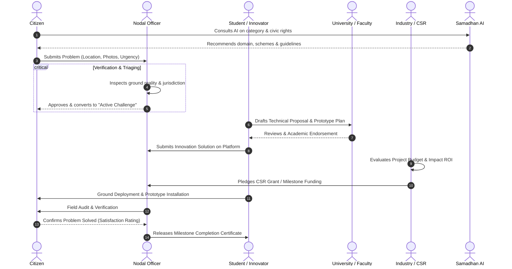
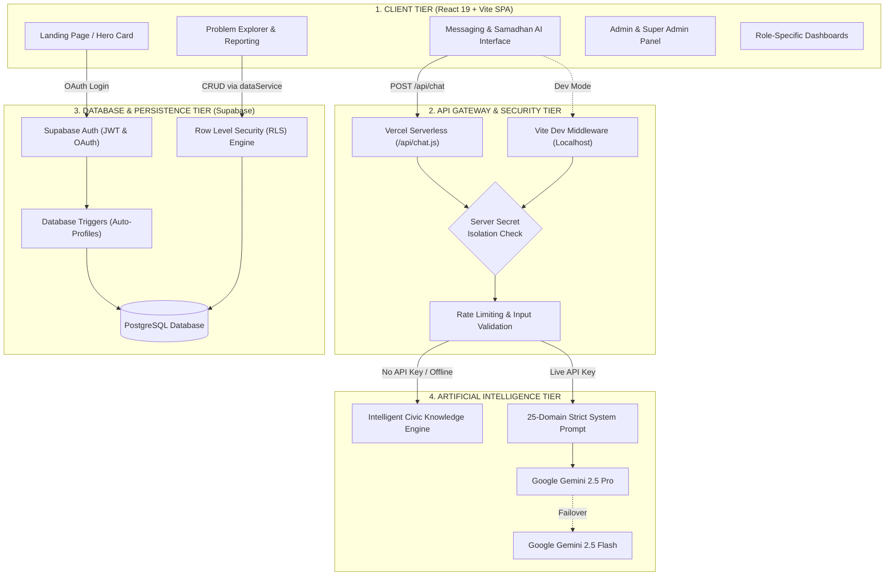
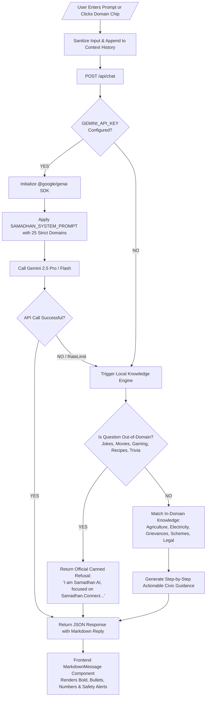
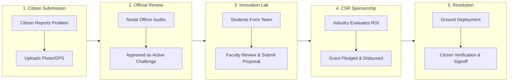

# Samadhan.Connect — Full Workflows & Flow Charts Specification

This document provides a comprehensive breakdown of all operational, technical, and algorithmic workflows in **Samadhan.Connect**, accompanied by Mermaid flow charts.

---

## 1. Master Civic Problem-Solving Workflow (5-Stakeholder Swimlane)



---

## 2. End-to-End System Architecture Data Flow



---

## 3. User Authentication & Role Onboarding Flow

```mermaid
flowchart TD
    Start([User Arrives at Platform]) --> ClickOAuth[User clicks 'Sign in with Google' or 'Sign in with GitHub']
    ClickOAuth --> SupaOAuth[Supabase OAuth 2.0 Provider Handlers]
    SupaOAuth --> TokenGen[JWT Session Created & Stored in LocalStorage]
    
    TokenGen --> DBTrigger{Does profile exist<br/>in PostgreSQL 'profiles'?}
    DBTrigger -- No --> CreateProfile[Trigger creates basic profile with name & email]
    DBTrigger -- Yes --> CheckRole{Does profile have<br/>a valid role assigned?}
    
    CreateProfile --> CheckRole
    
    CheckRole -- No --> ShowModal[Display RoleSelectionModal popup]
    ShowModal --> UserPicks[User selects 1 of 5 Roles:<br/>Citizen | Student | University | Industry | Nodal Officer]
    UserPicks --> SaveRole[DataService updates profile.role in DB]
    SaveRole --> CheckAdmin
    
    CheckRole -- Yes --> CheckAdmin{Is email == 'microsoft1gab@gmail.com'<br/>OR role == 'SUPER_ADMIN'?}
    
    CheckAdmin -- YES --> GrantSuperAdmin[Grant SUPER ADMIN Privileges<br/>Access to /admin Portal to promote any user]
    CheckAdmin -- NO --> RedirectDashboard[Redirect to Role Workspace Dashboard]

    GrantSuperAdmin --> Done([User Ready])
    RedirectDashboard --> Done
```

---

## 4. Samadhan AI 25-Domain Decision Engine



---

## 5. Problem Reporting to CSR Funding Pipeline


