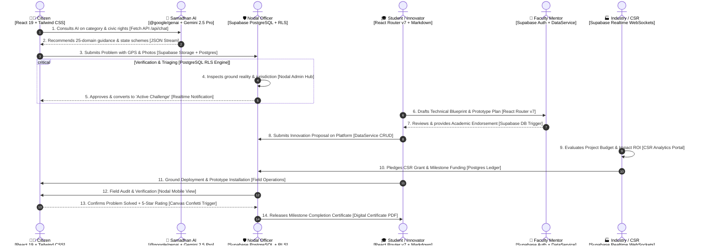
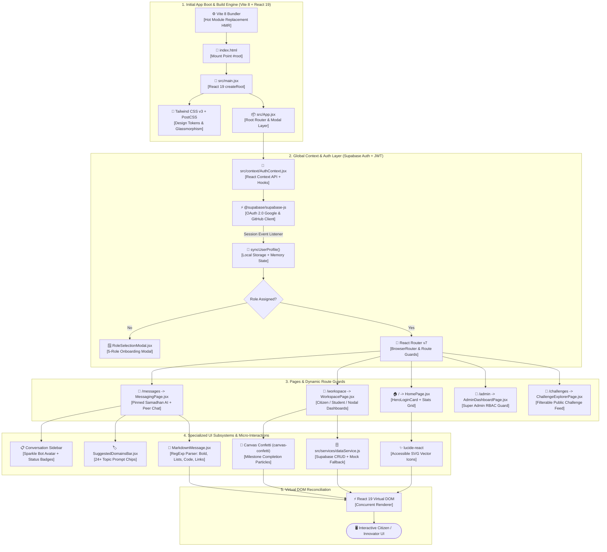
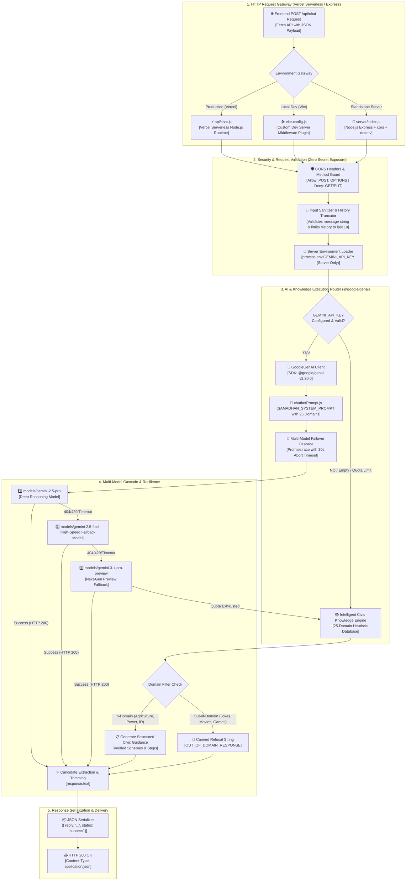
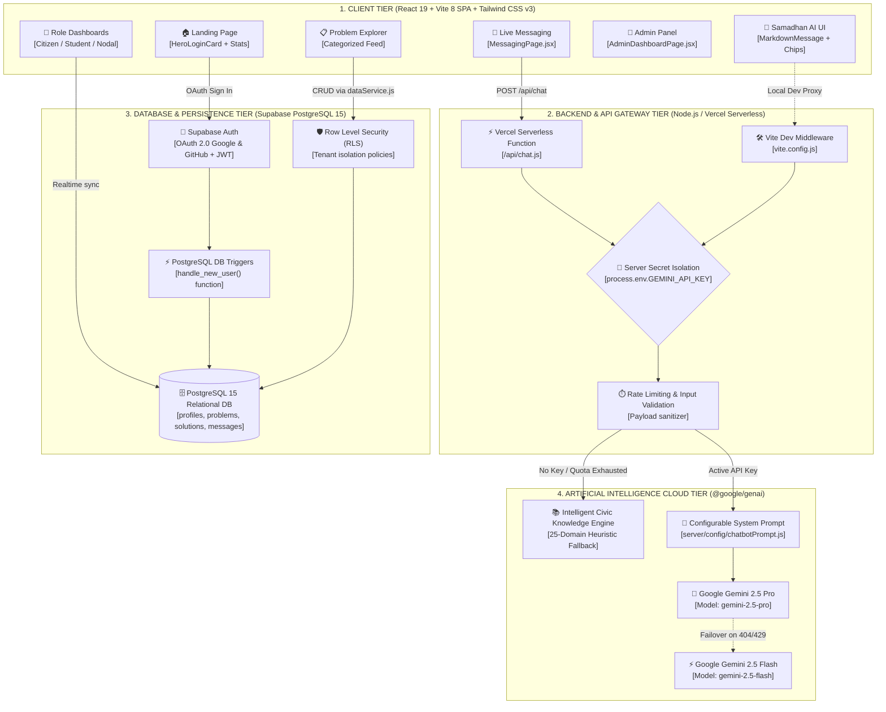
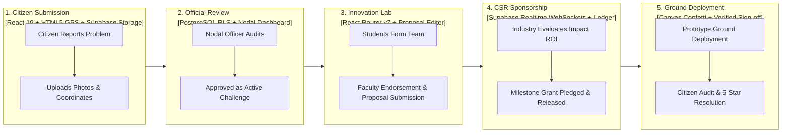

# Samadhan.Connect — Full Workflows, Technology Pipelines & Flow Charts

This document provides a comprehensive breakdown of all operational, technical, frontend, and backend technology workflows in **Samadhan.Connect**, with **explicit tech-stack annotations** on every step and Mermaid flow chart.

---

## 1. Master Civic Problem-Solving Workflow (Tech Stack Swimlane)



---

## 2. Frontend Technology Flowchart & Component Lifecycle



---

## 3. Backend Technology Flowchart & Request Execution Pipeline



---

## 4. End-to-End System Architecture Data Flow (With Tech Stacks)



---

## 5. User Authentication & Role Onboarding Flow (With Tech Stacks)

```mermaid
flowchart TD
    Start([🌐 User visits Samadhan.Connect]) --> ClickOAuth[User clicks 'Sign in with Google' or 'GitHub'<br/><b>Technology:</b> <i>HeroLoginCard.jsx + Navbar.jsx</i>]
    ClickOAuth --> SupaOAuth[Supabase OAuth 2.0 Provider Handlers<br/><b>Technology:</b> <i>supabase.auth.signInWithOAuth()</i>]
    SupaOAuth --> TokenGen[JWT Session Token Created & Saved<br/><b>Technology:</b> <i>Browser LocalStorage + JWT Bearer</i>]
    
    TokenGen --> DBTrigger{Does profile exist in PostgreSQL 'profiles' table?<br/><b>Technology:</b> <i>SQL Trigger: on_auth_user_created</i>}
    DBTrigger -- No --> CreateProfile[Trigger creates basic profile with email & full_name<br/><b>Technology:</b> <i>PL/pgSQL Trigger Function</i>]
    DBTrigger -- Yes --> CheckRole{Does profile have a valid role assigned?<br/><b>Technology:</b> <i>AuthContext.jsx check</i>}
    
    CreateProfile --> CheckRole
    
    CheckRole -- No (Role Missing) --> ShowModal[Display Role Selection Modal<br/><b>Technology:</b> <i>RoleSelectionModal.jsx (React 19 Portal)</i>]
    ShowModal --> UserPicks[User picks 1 of 5 Roles:<br/>Citizen | Student | University | Industry | Nodal Officer]
    UserPicks --> SaveRole[Update profile.role in Supabase DB<br/><b>Technology:</b> <i>dataService.updateProfile()</i>]
    SaveRole --> CheckAdmin
    
    CheckRole -- Yes (Role Present) --> CheckAdmin{Is email == 'microsoft1gab@gmail.com'<br/>OR role == 'SUPER_ADMIN'?}
    
    CheckAdmin -- YES --> GrantSuperAdmin[Grant SUPER ADMIN Privileges<br/><b>Technology:</b> <i>AdminDashboardPage.jsx (/admin)</i>]
    CheckAdmin -- NO --> RedirectDashboard[Redirect to Role Workspace<br/><b>Technology:</b> <i>React Router v7 Navigate to /workspace</i>]

    GrantSuperAdmin --> Done([🚀 User Ready on Platform])
    RedirectDashboard --> Done
```

---

## 6. Samadhan AI 25-Domain Decision Engine (With Tech Stacks)

```mermaid
flowchart TD
    UserQuery[/User Enters Prompt or Clicks Domain Chip/<br/><b>Tech:</b> <i>MessagingPage.jsx + SuggestedDomainsBar.jsx</i>] --> Trim[Sanitize Input & Slice Last 10 Messages<br/><b>Tech:</b> <i>aiChatService.js</i>]
    Trim --> SendReq[POST /api/chat<br/><b>Tech:</b> <i>Fetch API + JSON Body</i>]
    
    SendReq --> CheckEnv{GEMINI_API_KEY Configured?<br/><b>Tech:</b> <i>Node.js process.env</i>}
    
    %% Online Gemini Flow
    CheckEnv -- YES --> InitSDK[Initialize Google Gen AI Client<br/><b>Tech:</b> <i>@google/genai SDK v2.20.0</i>]
    InitSDK --> ApplySysPrompt[Apply System Prompt & 25 Allowed Domains<br/><b>Tech:</b> <i>server/config/chatbotPrompt.js</i>]
    ApplySysPrompt --> CallGemini[Execute Model Cascade: gemini-2.5-pro / flash<br/><b>Tech:</b> <i>ai.models.generateContent()</i>]
    
    CallGemini --> GeminiSuccess{API Response Received?<br/><b>Tech:</b> <i>Promise.race with 30s Timeout</i>}
    GeminiSuccess -- YES --> ReturnJSON[Return Clean JSON Response<br/><b>Tech:</b> <i>res.status(200).json({ reply, status: 'success' })</i>]
    GeminiSuccess -- NO / Rate Limit 429 --> FallbackLocal[Trigger Local Knowledge Fallback<br/><b>Tech:</b> <i>generateLocalKnowledgeReply()</i>]

    %% Offline / Fallback Flow
    CheckEnv -- NO --> FallbackLocal
    
    FallbackLocal --> CheckOutDomain{Is Question Out-of-Domain?<br/>Jokes, Movies, Gaming, Recipes, Gossip}
    
    CheckOutDomain -- YES --> RefuseOut[Return Canned Refusal Text<br/><b>Tech:</b> <i>OUT_OF_DOMAIN_RESPONSE constant</i>]
    CheckOutDomain -- NO --> MatchDomain[Match In-Domain Heuristic Database<br/><b>Tech:</b> <i>Agriculture, Electricity, Grievances, ID, Legal</i>]
    
    MatchDomain --> BuildStepGuide[Generate Step-by-Step Actionable Civic Guidance<br/><b>Tech:</b> <i>Verified State Portal Links & Helplines</i>]
    
    RefuseOut --> ReturnJSON
    BuildStepGuide --> ReturnJSON
    
    ReturnJSON --> RenderMD[Frontend Markdown Rendering<br/><b>Tech:</b> <i>MarkdownMessage.jsx (Bold, Bullets, Numbers, Links)</i>]
```

---

## 7. Problem Reporting to CSR Funding Pipeline (With Tech Stacks)


