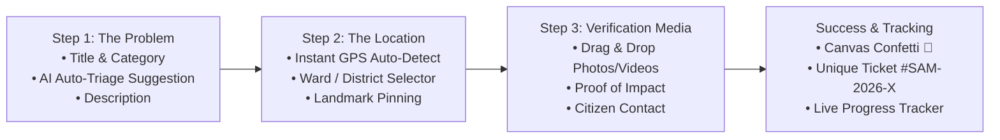

# Samadhan Connect — Design System & UI/UX Architecture (`design.md`)

> **Version:** 2.0  
> **Status:** Active / Production Standard  
> **Tech Stack:** React 19, Tailwind CSS v3, PostCSS, Lucide Icons, Lenis Smooth Scroll, Canvas Confetti  
> **Aesthetic Archetype:** Modern Civic-Tech & GovTech SaaS (High-Trust Authority + Futuristic SaaS Polish inspired by Linear, Stripe, and Apple)

---

## 1. Executive Summary & Design Vision

**Samadhan Connect** is India's collaborative civic innovation ecosystem uniting five core stakeholders:
1. **Citizens** (Reporting grassroots civic problems with geotagging & photo evidence)
2. **Students & Innovators** (Building prototypes, engineering solutions, competing in challenges)
3. **Faculty Mentors & Universities** (Academic endorsement, research validation, lab access)
4. **Government Nodal Officers & Ministries** (Publishing national RFPs, verifying problems, issuing grants)
5. **Industry Partners & CSR Funds** (Financing high-impact initiatives, scaling solutions)

### Core Tenets

```
        ┌─────────────────────────────────────────────────────────────┐
        │                    DESIGN TENETS                            │
        ├─────────────────────────────┬───────────────────────────────┤
        │ 🏛️ INSTITUTIONAL TRUST       │ ⚡ HIGH-VELOCITY SAAS POLISH   │
        │ Clean typography, clear     │ Micro-interactions, soft      │
        │ governance badges, verified │ glassmorphism, instant search,│
        │ department credentials.     │ smooth kinetic transitions.   │
        ├─────────────────────────────┼───────────────────────────────┤
        │ ♿ INCLUSIVE ACCESSIBILITY   │ 🤖 AI-AUGMENTED INTELLIGENCE │
        │ High-contrast ratios, focus │ Ambient AI assistance, prompt │
        │ indicators, touch targets.  │ chips, auto-categorization.   │
        └─────────────────────────────┴───────────────────────────────┘
```

---

## 2. Color Palette & Design Tokens

Samadhan Connect uses a carefully tailored **60-30-10** color distribution:
- **60% Dominant Base**: Clean light slate background in light mode (`bg-slate-50`), deep obsidian in dark mode (`bg-[#0B0F19]`).
- **30% Structure & Surface**: Frosted white glass cards (`bg-white/80 border-slate-200`) or deep navy glass (`bg-slate-900/90 border-slate-700/60`).
- **10% High-Impact Accent**: Energetic Emerald (`#16A34A` / `#22C55E`) symbolizing resolution, growth, and national progress.

### 2.1 Brand Green / Emerald Scale (Tailwind `brand`)

| Token | Hex | Tailwind Class | Usage Example |
| :--- | :--- | :--- | :--- |
| `brand-50` | `#F0FDF4` | `bg-brand-50` | Active pill backgrounds, light badges |
| `brand-100` | `#DCFCE7` | `bg-brand-100` | Soft highlight banners, active card tint |
| `brand-200` | `#BBF7D0` | `border-brand-200` | Hover card borders, chip borders |
| `brand-300` | `#86EFAC` | `border-brand-300` | Interactive focus rings, icon rings |
| `brand-400` | `#4ADE80` | `text-brand-400` | Dark mode accents, radiant glowing dots |
| `brand-500` | `#22C55E` | `bg-brand-500` | Primary interactive elements, success states |
| `brand-600` | `#16A34A` | `bg-brand-600` | **Primary Brand Color** (CTAs, hero buttons) |
| `brand-700` | `#15803D` | `bg-brand-700` | Button hover states, dark badge text |
| `brand-800` | `#166534` | `text-brand-800` | High-contrast body text on light green |
| `brand-900` | `#14532D` | `text-brand-900` | Deep contrast text & footer accents |
| `brand-950` | `#052E16` | `bg-brand-950` | Dark hero gradients, deep card surfaces |

### 2.2 Semantic & Functional Colors

| Role | Color Name | Hex / Class | Application |
| :--- | :--- | :--- | :--- |
| **Government / Official** | Sky / Blue 600 | `#2563EB` / `text-blue-600` | Ministry verified stamps, RFP tags |
| **Urgent / Civic Alert** | Rose 500 | `#EF4444` / `text-rose-500` | Critical priority tickets, expiring timers |
| **Pending / Under Review** | Amber 500 | `#F59E0B` / `text-amber-500` | Milestone review, draft submissions |
| **Academia / Research** | Indigo 600 | `#4F46E5` / `text-indigo-600` | University labs, patent indicators |
| **Industry / CSR Grants** | Violet 600 | `#7C3AED` / `text-violet-600` | Grant allocations, corporate pledges |

---

## 3. Typography Hierarchy & Font Rules

We combine **Outfit** (modern geometric sans for display headings) with **Plus Jakarta Sans** and **Inter** (ultra-legible, crisp body copy).

```
   ┌───────────────────────────────────────────────────────────┐
   │  H1 — 40px–56px Outfit Bold (tracking-tight)              │
   │  "Where National Challenges Meet Groundbreaking Solutions"│
   │                                                           │
   │  H2 — 28px–36px Outfit SemiBold                           │
   │  "Active Challenges & Civic Innovation Hub"               │
   │                                                           │
   │  Body — 15px–16px Plus Jakarta Sans Regular/Medium         │
   │  Crisp rendering, 1.6 line height for comfortable reading.│
   │                                                           │
   │  Code/Metadata — 13px JetBrains Mono / Fira Code          │
   │  TICKET #SAM-2026-8942 • GPS: 28.6139° N, 77.2090° E      │
   └───────────────────────────────────────────────────────────┘
```

### Typography Scale Table

| Element | Font Family | Size (Desktop / Mobile) | Weight | Tracking | Class String |
| :--- | :--- | :--- | :--- | :--- | :--- |
| **Display Hero** | Outfit | `56px` / `36px` | 800 (ExtraBold) | `-0.03em` | `font-display text-4xl sm:text-6xl font-extrabold tracking-tight` |
| **Section Title (H2)** | Outfit | `36px` / `26px` | 700 (Bold) | `-0.02em` | `font-display text-2xl sm:text-4xl font-bold tracking-tight` |
| **Card Header (H3)** | Outfit | `22px` / `18px` | 600 (SemiBold) | `-0.01em` | `font-display text-lg sm:text-xl font-semibold` |
| **Subhead / Lead** | Plus Jakarta Sans | `18px` / `16px` | 400 (Normal) | `normal` | `font-sans text-base sm:text-lg text-slate-600 leading-relaxed` |
| **Body Standard** | Plus Jakarta Sans | `15px` / `14px` | 400 (Normal) | `normal` | `font-sans text-sm sm:text-base text-slate-700 leading-normal` |
| **Button / Label** | Plus Jakarta Sans | `14px` / `13px` | 600 (SemiBold) | `+0.01em` | `font-sans text-sm font-semibold tracking-wide` |
| **Badge / Caption** | Plus Jakarta Sans | `12px` / `11px` | 600 (SemiBold) | `+0.02em` | `font-sans text-xs font-semibold uppercase tracking-wider` |
| **Data / Numbers** | Outfit / Mono | `24px` / `20px` | 700 (Bold) | `-0.02em` | `font-display font-bold tabular-nums text-slate-900` |

---

## 4. Spacing, Elevation & Surface Tokens

### 4.1 Spacing & Radius Rhythm
- **Base Grid**: `4px` / `8px` standard multiplier (`p-2`, `p-4`, `p-6`, `p-8`).
- **Border Radius**:
  - Inner tags/pills: `rounded-full` (9999px)
  - Input fields & buttons: `rounded-xl` (12px)
  - Cards & Panels: `rounded-2xl` (16px)
  - Hero containers & Modals: `rounded-3xl` (24px)

### 4.2 Elevation & Shadow Hierarchy

```css
/* Clean Soft Shadow */
.shadow-soft {
  box-shadow: 0 10px 30px -10px rgba(15, 23, 42, 0.06), 
              0 4px 6px -4px rgba(15, 23, 42, 0.03);
}

/* Emerald Ambient Glow */
.shadow-glow {
  box-shadow: 0 0 25px -5px rgba(22, 163, 74, 0.25);
}

/* Glass Surface Standard */
.glass-card {
  background: rgba(255, 255, 255, 0.88);
  backdrop-filter: blur(12px);
  -webkit-backdrop-filter: blur(12px);
  border: 1px solid rgba(226, 232, 240, 0.8);
}
```

---

## 5. Master Component Specifications

### 5.1 Interactive Buttons

```
  Primary Brand CTA            Glass Secondary               Glowing Action
┌──────────────────────┐     ┌──────────────────────┐     ┌──────────────────────┐
│  ⚡ Solve Challenge → │     │  🔍 Explore All (48) │     │  ✨ Ask Samadhan AI   │
└──────────────────────┘     └──────────────────────┘     └──────────────────────┘
  bg-brand-600 text-white      bg-white/80 border           bg-brand-500 shadow-glow
  hover:bg-brand-700           hover:bg-slate-100           hover:scale-[1.02]
  active:scale-[0.97]          active:scale-[0.97]          active:scale-[0.97]
```

- **Micro-Interaction Rules**:
  - Every button has an active press reduction: `active:scale-[0.97] transition-transform duration-150`.
  - Icons inside buttons feature an arrow nudge on hover: `group-hover:translate-x-1 transition-transform`.

### 5.2 Challenge Card (`ChallengeCard.jsx`)

```
┌────────────────────────────────────────────────────────────────────────┐
│ [🏢 Ministry of Jal Shakti]               [🟢 Active Challenge • 14d] │
│                                                                        │
│ Smart Real-Time IoT Water Quality Monitoring in Rural Aquifers         │
│ Low-power sub-gigahertz sensor networks for community handpumps.       │
│                                                                        │
│ 🏷️ IoT & Sensors   🏷️ Clean Water   🏷️ Hardware Prototype           │
│                                                                        │
│ ┌────────────────────────────────────────────────────────────────────┐ │
│ │ 💰 Grant: ₹25,00,000       👥 18 Teams Pledged    ⏳ 14 Days Left   │ │
│ └────────────────────────────────────────────────────────────────────┘ │
│                                                                        │
│ [View Problem Statement]                        [🚀 Submit Solution →] │
└────────────────────────────────────────────────────────────────────────┘
```
- **States**:
  - Default: Border `border-slate-200`, subtle shadow.
  - Hover: `hover:-translate-y-1 hover:border-brand-400 hover:shadow-xl transition-all duration-300`.
  - Funding Pill: Monospaced bold tabular figures (`font-bold tabular-nums text-emerald-600`).

### 5.3 Citizen Problem Reporting Wizard (`ReportProblemPage.jsx`)
Transform single-page cluttered forms into a **3-Step Frictionless Flow**:



- **Features**:
  - **AI Assistant Pill**: When the user enters "Water pipeline broken near school", Samadhan AI prompts:
    *"Suggested Category: Water & Sanitation • Urgency: High (Public Health risk) [Apply Suggestion]"*.
  - **Ticket Tracker Card**: Generated ticket is presented like a boarding pass with QR code and shareable link.

### 5.4 Unified Navigation & Glass Header (`Navbar.jsx`)
- **Position**: `sticky top-0 z-50 backdrop-blur-md bg-white/80 border-b border-slate-200/80`.
- **Items**:
  - Brand Mark: Interlocking geometric 'S' badge with emerald gradient.
  - Nav Links: Clean pill hover states (`hover:bg-slate-100/80 rounded-lg px-3 py-2`).
  - Search Trigger: Pill with `Ctrl + K` badge (`⌘K`).
  - Notification Hub: Bell with unread pulsating badge dot.
  - Role Selector / Profile: Compact avatar with role chip (`👨‍🌾 Citizen`, `🎓 Student`, `🛡️ Nodal`).

### 5.5 Samadhan AI Chatbot Widget (`ChatWidget.jsx`)
- **Launcher**: Floating orb in bottom right corner (`bottom-6 right-6`).
  - Gradient pulse ring (`animate-pulse shadow-glow`).
- **Chat Drawer**:
  - Glass header with status dot ("Samadhan AI • Online • 25 Govt Schemes Synced").
  - Streamed typing animation for answers.
  - Interactive chip carousel at bottom of input:
    `[Find AI Grants]` `[Report Civic Problem]` `[Eligibility Rules]` `[Track Ticket]`

---

## 6. Layout Archetypes & Page Blueprints

### 6.1 Landing Page (`HomePage.jsx`) Structure
1. **Announcement Ticker**:
   - `[🇮🇳 National Innovation Challenge 2026 Live — ₹50 Lakhs in Seed Grants →]`
2. **Kinetic Hero**:
   - Dynamic radial ambient background.
   - Dual action buttons + social proof avatar cluster ("Joined by 1,400+ innovators across 120+ colleges").
3. **Infinite Marquee Ticker**:
   - Continuous scroll of real-time platform updates using CSS or Magic UI marquee.
4. **4-Pillar Bento Grid**:
   - Asymmetrical modern card grid highlighting Government, Universities, Industry CSR, and Citizens.
5. **Live Impact Metric Tiles**:
   - Four counter cards with glowing emerald headers.
6. **Featured Challenges Carousel**:
   - Interactive preview of top urgent challenges.

### 6.2 Workspace & Collaboration (`ProjectWorkspacePage.jsx`)
- **Split-Pane Architecture**:
  - Left Panel: Challenge overview, milestone checklist, submitted deliverables.
  - Center Panel: Real-time milestone tracker (Concept $\rightarrow$ Prototype $\rightarrow$ Field Testing $\rightarrow$ Deployed).
  - Right Panel: Team member avatars, nodal officer review feedback, and file repository.

---

## 7. Motion, Animations & Micro-Interactions

| Interaction Type | Trigger | Animation Specs | Implementation |
| :--- | :--- | :--- | :--- |
| **Page Scrolling** | Scroll Wheel / Touch | Inertial smooth scroll | `lenis` smooth scrolling instance |
| **Card Hover** | Mouse Enter | `-translate-y-1` + border color fade | `transition-all duration-300 ease-out` |
| **Button Click** | Mouse Down | `scale-[0.97]` | `active:scale-[0.97] transition-transform` |
| **Milestone Complete**| Problem Solved | Particle burst | `canvas-confetti` fireworks preset |
| **Notification Ping** | Realtime Event | Pulsing dot | `animate-ping duration-1000` |
| **Skeleton Loader** | Data Fetching | Shimmer sweep gradient | `animate-pulse bg-slate-200/80` |

---

## 8. Accessibility (a11y) & Performance Standards

1. **Color Contrast (WCAG 2.1 AA)**:
   - Normal text has a minimum contrast ratio of `4.5:1` against its background.
   - Large display text has at least `3:1`.
2. **Keyboard Focusability**:
   - Focus indicators are never removed (`outline-none`). Instead, styled with:
     `focus-visible:ring-2 focus-visible:ring-brand-500 focus-visible:ring-offset-2`.
3. **Touch Targets**:
   - All mobile buttons and clickable chips meet the `44px × 44px` minimum touch target.
4. **Performance Budgets**:
   - Image assets served in modern WebP format.
   - Icons imported individually from `lucide-react` for tree-shaking.
   - Initial DOM load kept lightweight with lazy route splitting.

---

## 9. Directory & File Conventions

```
samadhanconnect/
├── design.md                          <-- This Master Design Document
├── NEXT_LEVEL_FRONTEND_REDESIGN_GUIDE.txt <-- Tactical redesign guide & prompts
├── tailwind.config.js                 <-- Design tokens & color scales
├── src/
│   ├── index.css                      <-- Global CSS, Lenis, & micro-utilities
│   ├── components/
│   │   ├── ui/                        <-- Atomic primitives (Buttons, Badges, Cards)
│   │   │   ├── StatusBadge.jsx
│   │   │   └── ...
│   │   ├── challenges/                <-- Challenge cards, filters, timeline
│   │   │   ├── ChallengeCard.jsx
│   │   │   └── ...
│   │   ├── layout/                    <-- Navbar, Footer, Sidebar, RoleGuard
│   │   │   ├── Navbar.jsx
│   │   │   └── ...
│   │   └── chat/                      <-- AI Copilot widget & suggestion chips
│   └── pages/                         <-- Master page views
│       ├── HomePage.jsx
│       ├── ChallengesPage.jsx
│       ├── ReportProblemPage.jsx
│       └── dashboards/
```

---

## 10. Design Checklist for New Features

Before any new component or page is shipped, verify against this checklist:

- [ ] Does it adhere to the **Outfit** (headings) and **Plus Jakarta Sans** (body) font hierarchy?
- [ ] Are buttons using the standardized active press state (`active:scale-[0.97]`)?
- [ ] Are cards using the subtle border and hover lift (`hover:-translate-y-1 hover:border-brand-400`)?
- [ ] Does it have accessible `:focus-visible` ring indicators?
- [ ] Are badges color-coded accurately by stakeholder and status?
- [ ] Is it fully responsive on mobile screen viewports ($375\text{px}$ to $430\text{px}$)?
- [ ] Does it provide clear loading skeletons during asynchronous data fetches?
